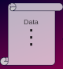

# Compute and Metacompute

| Compute | Metacompute |
| :-----: | :---------: |
|  |  |
| operate on data | configure resources |
| algorithms and data structures | organize and navigate storage |
| business logic | manage access between different users |
| arithmetic | interface with humans |
